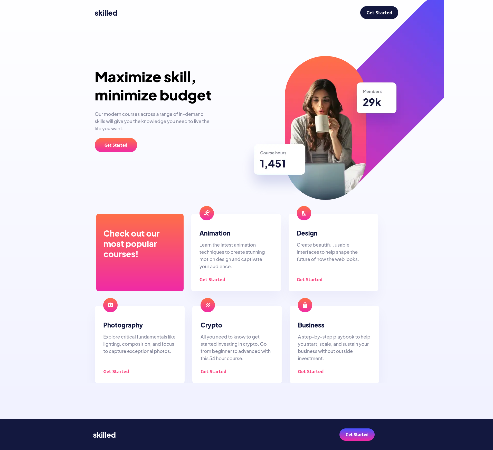

# Frontend Mentor - Skilled e-learning landing page solution

This is a solution to the [Skilled e-learning landing page challenge on Frontend Mentor](https://www.frontendmentor.io/challenges/skilled-elearning-landing-page-S1ObDrZ8q). Frontend Mentor challenges help you improve your coding skills by building realistic projects.

## Table of contents

- [Overview](#overview)
  - [The challenge](#the-challenge)
  - [Screenshot](#screenshot)
  - [Links](#links)
- [My process](#my-process)
  - [Built with](#built-with)
  - [What I learned](#what-i-learned)
  - [Continued development](#continued-development)
  - [Useful resources](#useful-resources)
- [Author](#author)
- [Acknowledgments](#acknowledgments)

## Overview

### The challenge

Users should be able to:

- View the optimal layout depending on their device's screen size
- See hover states for interactive elements

### Screenshot



### Links

- Solution URL: [Solution To Compare My Code With](https://www.frontendmentor.io/solutions/skilled-elearning-css-grid-L4_Q3XaGJG)
- Live Site URL: [Link to Site](https://zman64.github.io/skilled-e-learning/)

## My process

### Built with

- HTML5 markup
- CSS custom properties
- Flexbox
- CSS Grid
- Mobile-first workflow

### What I learned

- How to make the images responsive depending on what device it's on.

```html
<picture class="heroRight">

      <source media="(min-width: 1024px)" 
      srcset="./assets/image-hero-desktop.webp,
              ./assets/image-hero-desktop@2x.webp 2x" alt="Woman drinking coffee"
      >

      <source media="(min-width: 768px)" 
      srcset="./assets/image-hero-tablet.webp,
              ./assets/image-hero-tablet@2x.webp 2x" alt="Woman drinking coffee">
      
    </picture>
```

- Engage on how to postion the hero image in desktop and tablet mode. I had a hard time
on how to position this in combination with how to layout column width for CSS Grid. Since the image
goes outside of the container I decided to make it absolute and manually position it relative to the container
it is in.

- I set a max width on the container that is close to the figma sketch. The result being that the container will not be fluid
on wider screens.

```css
 .heroRight {
        position: relative;
        right: 0;
        max-width: 100%;
        top: 0;
        left: 0;
        bottom: 0;
        
    }
    .heroRight__image {
        position: absolute;
        max-width: none;
        top: -13rem;
        left: -3rem;

    }
```

### Continued development

- I would like to refine the best way to position the overall container so it's still responsive on really wide screens instead
of being set with a max width and positioned in the middle.

- I would like to continue the best/straight forwards ways to position hero images and make them responsive and fluid. It was difficult for me on how to best approach styling and positioning the image so it fits well with the rest of the layout.

### Useful resources

- [Responsive Images](https://www.youtube.com/watch?v=Q5m8cCGdiBo) - This is a video that helped me to understand better how to make images more responsive.

## Author

- Website - [Zachary Kahlig](www.linkedin.com/in/zachary-kahlig-0a595912a)
- Frontend Mentor - [@zman64](https://www.frontendmentor.io/profile/zman64)
